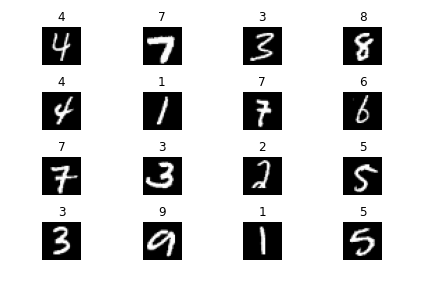
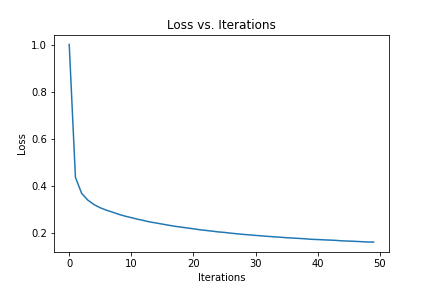
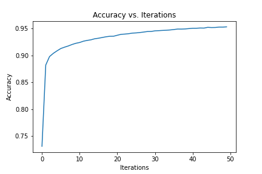
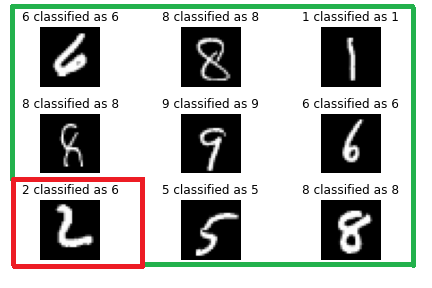

# Artificial Neural Network (ANN)

Image classification using MNIST database based on handwritten digits

## Training data
Random digits taken from the MNIST database indicating the classification to which it belongs

## Loss and Accuracy Graphs vs. Iterations

## Prediction
Random digits taken from the prediction, showing the classification given by the model training, obtaining an accuracy of **94.86%**

